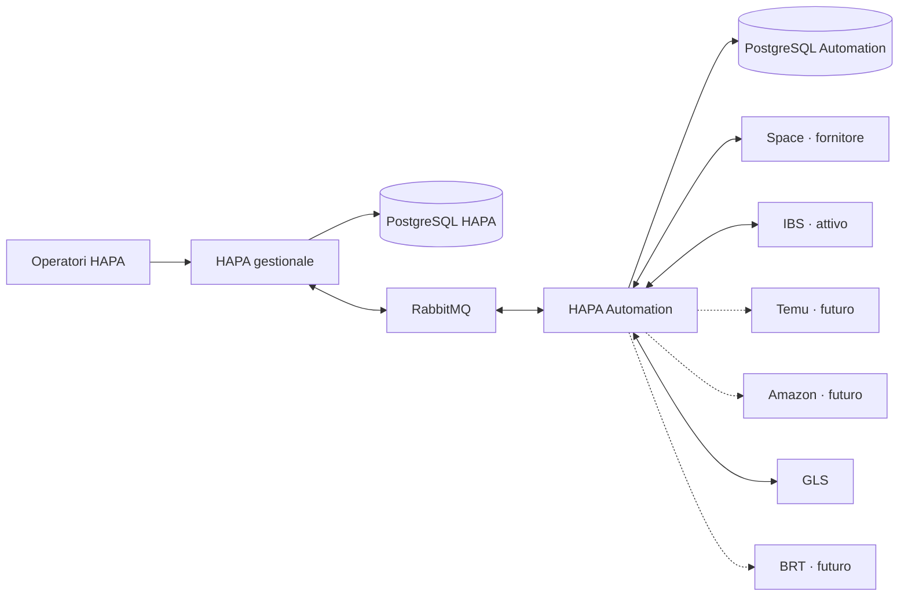

# HAPA

HAPA è il gestionale della realtà commerciale separata da Space che acquista articoli da Space e li rivende sui marketplace. IBS è il canale attualmente attivo; Temu e Amazon sono i prossimi canali previsti.

HAPA è il **system of record aziendale**. Conserva le decisioni e lo storico commerciale: prodotti venduti, offerte e ricarichi, clienti, ordini di vendita, acquisti verso Space, spedizioni, documenti e audit. Space è un fornitore esterno, non il database del gestionale.

Le chiamate tecniche verso Space, IBS, Temu, Amazon, GLS e in futuro BRT vengono eseguite dal servizio separato [`jellero/hapa-automation`](https://github.com/jellero/hapa-automation). Il servizio usa un proprio database per cursori, retry, idempotenza e operazioni provider, ma non diventa proprietario di prodotti, clienti o ordini.

## Confine del sistema



## Proprietà dei dati

| Area | Proprietario autorevole |
|---|---|
| prodotto canonico HAPA | HAPA |
| offerta fornitore, costo e disponibilità Space osservati | HAPA, alimentato da eventi Space |
| regole di ricarico e prezzo di vendita desiderato | HAPA |
| cliente, identità marketplace e storico | HAPA |
| ordine di vendita marketplace | HAPA |
| ordine di acquisto verso Space | HAPA |
| colli, spedizione, tracking e riferimento etichetta | HAPA |
| fatture e corrispettivi futuri | HAPA |
| cursori, retry, rate limit, chiamate e risposte provider | HAPA Automation |
| proiezioni tecniche ricostruibili | HAPA Automation |

Prodotti e ordini non vengono spostati in Automation. Il suo database può conservarne soltanto una proiezione minima, derivata e ricostruibile, necessaria a eseguire una specifica chiamata o riconciliazione.

## Flussi principali

### Catalogo e offerte

1. Automation legge da Space catalogo, costo di acquisto e disponibilità.
2. HAPA deduplica l’osservazione e cerca il prodotto per ID Space, EAN e SKU.
3. Se il prodotto non esiste, HAPA lo crea inattivo in `pending_review` e registra separatamente l’offerta Space.
4. Conflitti di identità finiscono in revisione manuale e non pubblicano offerte.
5. HAPA calcola quantità vendibile e prezzo finale usando ricarico, costi e policy del canale.
6. HAPA emette un comando con prezzo e quantità già decisi.
7. Automation pubblica l’offerta su IBS e restituisce l’esito tecnico.

Automation non ricalcola i ricarichi e non decide il prezzo.

### Ordine, acquisto e spedizione

1. Automation osserva un ordine IBS e lo invia a HAPA.
2. HAPA registra cliente, identità esterna, snapshot degli indirizzi, ordine e righe economiche.
3. HAPA crea una distinta richiesta di acquisto verso Space; l’ordine di vendita e quello di acquisto non condividono lo stesso stato.
4. Automation invia l’acquisto a Space e restituisce gli esiti.
5. HAPA governa eccezioni, disponibilità, picking, colli e chiusura operativa.
6. HAPA richiede la spedizione; Automation chiama GLS, acquisisce etichetta e tracking e restituisce l’esito.
7. L’etichetta viene resa stampabile dall’interfaccia HAPA e il fulfilment viene comunicato a IBS.

Il flusso completo è in [`docs/BUSINESS_FLOWS.md`](docs/BUSINESS_FLOWS.md).

## Architettura

I due repository hanno database, immagini, migrazioni e cicli di rilascio separati. RabbitMQ è infrastruttura di integrazione condivisa: trasporta eventi e comandi versionati, non replica i database.

Principi:

- un solo writer autorevole per ogni dato di business;
- transazioni locali con outbox e inbox;
- consistenza eventuale tra servizi;
- idempotenza end-to-end;
- comandi HAPA per le azioni esterne e eventi Automation per osservazioni ed esiti;
- nessuna decisione commerciale nel runtime tecnico;
- snapshot storici per ordini, clienti e documenti;
- vertical slice attivate una alla volta, iniziando da IBS.

La progettazione completa, compresi i diagrammi recuperati e riallineati, è in [`docs/ARCHITECTURE.md`](docs/ARCHITECTURE.md). Il modello dati è in [`docs/DATA_MODEL.md`](docs/DATA_MODEL.md).

## Stack

- PHP 8.4 e componenti Symfony selezionati;
- PostgreSQL e Redis;
- RabbitMQ tramite `php-amqplib`;
- Phinx, PHPUnit e PHPStan;
- Docker e Docker Compose.

## Avvio locale

```bash
cp .env.example .env
docker network create hapa-messaging 2>/dev/null || true
docker compose up --build -d
docker compose exec php composer install
docker compose exec php vendor/bin/phinx migrate -e development
docker compose exec php php bin/console system:check
```

Il runtime asincrono viene avviato dal repository `hapa-automation`.

## Qualità

```bash
composer ci:fast
composer ci:full
```

## Documentazione

| Documento | Contenuto |
|---|---|
| [`docs/ARCHITECTURE.md`](docs/ARCHITECTURE.md) | sistema distribuito, confini e topologia |
| [`docs/DATA_MODEL.md`](docs/DATA_MODEL.md) | proprietà e struttura dei dati |
| [`docs/BUSINESS_FLOWS.md`](docs/BUSINESS_FLOWS.md) | catalogo, ordini, acquisti e spedizioni |
| [`docs/CATALOG_PRICING.md`](docs/CATALOG_PRICING.md) | catalogo Space, costi, ricarichi e offerte |
| [`docs/CUSTOMERS_AND_ORDERS.md`](docs/CUSTOMERS_AND_ORDERS.md) | clienti, storico e ordini di vendita |
| [`docs/FISCAL.md`](docs/FISCAL.md) | confine futuro di fatture e corrispettivi |
| [`docs/TODO.md`](docs/TODO.md) | roadmap per vertical slice |

## Licenza e proprietà

Codice e documentazione sono proprietari.
