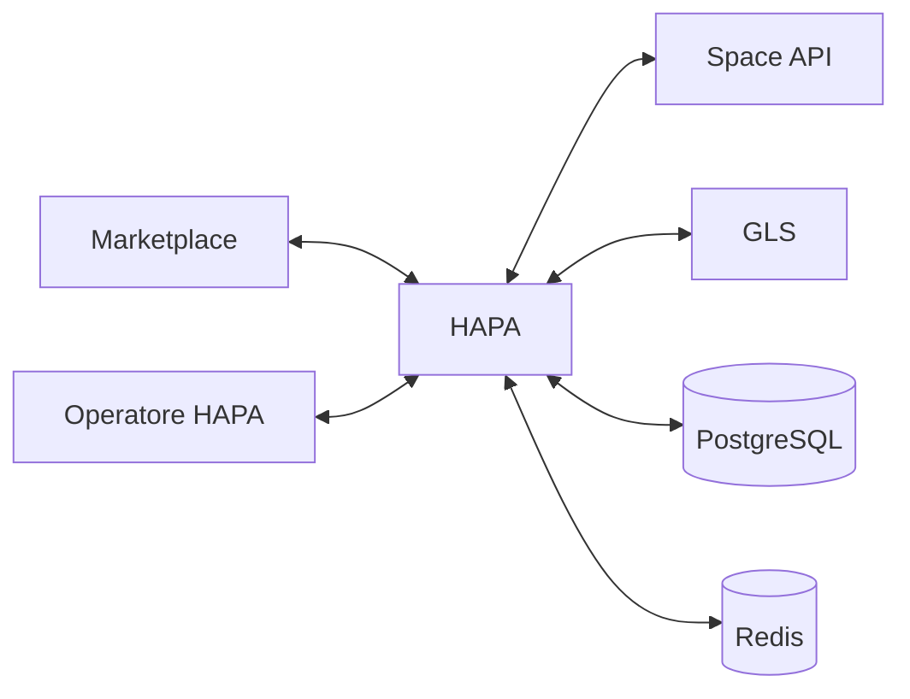
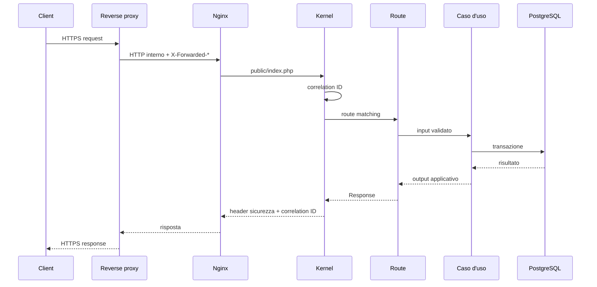
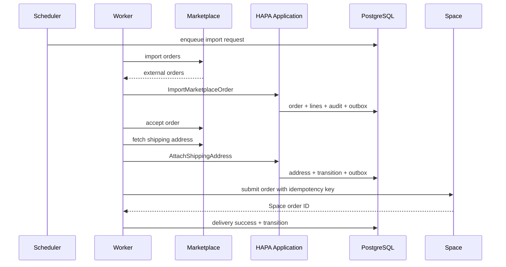
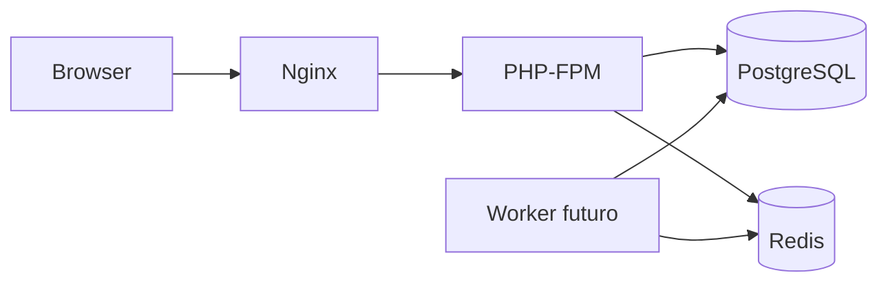
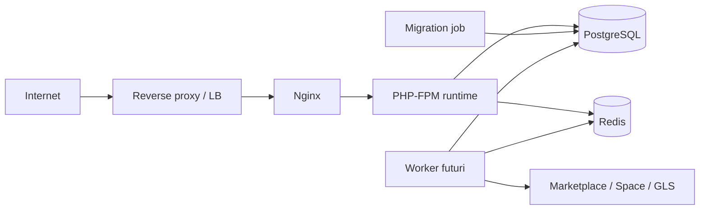

# Architettura tecnica HAPA

## 1. Scopo del documento

Questo documento descrive l’architettura applicativa, infrastrutturale e operativa di HAPA. Costituisce il riferimento tecnico per sviluppo, revisione del codice, integrazioni, deploy e gestione evolutiva.

La documentazione distingue sempre tre livelli di maturità:

- **implementato**: presente nel repository e verificato dalla pipeline;
- **parziale**: struttura o contratto presente, comportamento operativo ancora incompleto;
- **pianificato**: definito come direzione architetturale e riportato nella roadmap.

La roadmap esecutiva è mantenuta in [`TODO.md`](TODO.md). I requisiti di sicurezza sono mantenuti in [`SECURITY.md`](SECURITY.md). Il portafoglio e i gate delle integrazioni marketplace sono mantenuti in [`MARKETPLACES.md`](MARKETPLACES.md). Il layer di presentazione è descritto in [`INTERFACE.md`](INTERFACE.md).

---

## 2. Obiettivo del sistema

HAPA governa il ciclo ordine tra marketplace, Space API, magazzino e GLS.

Il sistema deve:

1. importare ordini da marketplace eterogenei;
2. accettare l’ordine sul canale sorgente;
3. acquisire e normalizzare l’indirizzo di spedizione;
4. memorizzare ordine e righe in modo idempotente;
5. inviare l’ordine a Space tramite API;
6. aggiornare disponibilità e quantità gestibili;
7. supportare picking completo o parziale tramite barcode;
8. produrre colli, spedizione ed etichetta GLS;
9. restituire tracking e fulfilment al marketplace;
10. offrire controllo operativo, audit, retry e riconciliazione.

HAPA mantiene lo **stato autorevole del processo interno**. Marketplace, Space e GLS restano sistemi esterni con stato proprio; la coerenza tra i sistemi viene raggiunta mediante idempotenza, delivery persistite e riconciliazione.

---

## 3. Principi architetturali

### 3.1 Framework custom proprietario

HAPA utilizza una foundation applicativa proprietaria in PHP 8.4. Componenti Symfony selezionati forniscono primitive consolidate per HTTP, routing, console e caricamento dell’ambiente. Il dominio, i casi d’uso, la persistenza e le integrazioni restano sotto controllo diretto del progetto.

### 3.2 Moduli con confini espliciti

Il codice viene organizzato per capacità di business. Ogni modulo espone contratti e tipi propri. Le dipendenze tra moduli attraversano contratti espliciti e sono verificate da controlli architetturali automatici.

### 3.3 Stato deterministico

Le modifiche allo stato ordine devono attraversare casi d’uso e regole di transizione dichiarate. Scritture dirette e transizioni implicite riducono la tracciabilità e verranno escluse dalla parte funzionale.

### 3.4 PostgreSQL come sorgente autorevole

PostgreSQL conserva dominio, outbox, tentativi di integrazione e audit. Redis fornisce capacità di supporto, mai la sola copia di un dato necessario alla ricostruzione del processo.

### 3.5 Consistenza transazionale interna

Le modifiche di dominio e la produzione dei messaggi outbox appartengono alla stessa transazione PostgreSQL. I confini verso provider esterni adottano consistenza eventuale, retry e riconciliazione.

### 3.6 Idempotenza end-to-end

Import, invio a Space, creazione spedizione, tracking e retry devono utilizzare chiavi idempotenti stabili. Le protezioni vengono applicate sia nel codice sia tramite vincoli univoci PostgreSQL.

### 3.7 Osservabilità incorporata

Correlation ID, log strutturati, delivery esterne e audit accompagnano ogni operazione rilevante. Metriche e tracing verranno aggiunti insieme ai primi workload operativi.

### 3.8 Sicurezza a più livelli

Validazione applicativa, vincoli database, runtime container, Nginx, reverse proxy e gestione dei segreti formano livelli complementari. Ogni livello conserva responsabilità specifiche.

### 3.9 Evoluzione per vertical slice

Le funzionalità vengono realizzate come flussi completi, con dominio, persistenza, integrazione, test e osservabilità. La prima vertical slice attraverserà Marketplace → HAPA → Space.

---

## 4. Contesto del sistema



### 4.1 Sistemi esterni

| Sistema | Responsabilità | Modalità prevista |
|---|---|---|
| Canali marketplace | origine ordine, accettazione, indirizzo, fulfilment, tracking | Amazon, eMAG, Temu e IBS tramite adapter |
| Connettori marketplace | percorso tecnico verso uno o più canali | SellRapido aggregatore oppure adapter diretto |
| Space | ricezione ordine, approvvigionamento e disponibilità | API |
| GLS | spedizione, label, tracking e gestione operativa della spedizione | API o servizio integrato GLS |
| Reverse proxy | TLS, HSTS, routing di frontiera, eventuale rate limiting | infrastruttura esterna al Compose applicativo |

### 4.2 Canali e connettori marketplace

HAPA distingue il canale sul quale nasce l’ordine dal connettore usato per trasportarlo. SellRapido è un connettore aggregatore; Amazon, eMAG, Temu e IBS sono canali di vendita. Gli adapter diretti mantengono invece lo stesso codice logico per canale e connettore.

Un ordine conserva sempre il canale sorgente, anche quando arriva tramite SellRapido. Questa separazione impedisce che un cambio di percorso tecnico alteri l’identità di business e permette di bloccare import concorrenti dello stesso account-canale.

Il portafoglio, i gate di discovery e la procedura di migrazione tra connettori sono definiti in [`MARKETPLACES.md`](MARKETPLACES.md).

### 4.3 Confini di fiducia

- il traffico pubblico termina sul reverse proxy;
- Nginx applicativo ascolta su loopback per impostazione production;
- PHP-FPM, PostgreSQL e Redis operano sulla rete Docker interna;
- i provider esterni vengono trattati come sistemi fallibili e potenzialmente lenti;
- payload e risposte esterne richiedono validazione prima di entrare nel dominio;
- dati personali e credenziali seguono policy di minimizzazione e redazione.

---

## 5. Stack tecnico

| Area | Tecnologia |
|---|---|
| Linguaggio | PHP 8.4 |
| Runtime HTTP | PHP-FPM + Nginx |
| Routing e HTTP | Symfony Routing + HttpFoundation |
| Console | Symfony Console |
| Configurazione locale | Symfony Dotenv |
| Database | PostgreSQL 17 |
| Cache e coordinamento | Redis 7.4 |
| Migrazioni | Phinx |
| Logging | Monolog con output JSON |
| Test | PHPUnit 11 |
| Analisi statica | PHPStan 2 |
| Container | Docker e Docker Compose |
| CI | GitHub Actions |

Il namespace applicativo è `Hapa\`.

---

## 6. Struttura del repository

```text
app/
  Core/                   runtime e servizi trasversali
  Modules/                moduli applicativi e contratti
bin/
  console                 entry point CLI
config/
  routes.php              composizione delle route HTTP
database/
  migrations/             schema PostgreSQL versionato
docker/
  php/                     immagini e configurazioni PHP
  nginx.conf               configurazione Nginx
  redis-entrypoint.sh      generazione configurazione Redis da secret
docs/
  ARCHITECTURE.md          questo documento
public/
  assets/                  CSS, JavaScript e sprite SVG dell’interfaccia
  index.php                front controller HTTP
scripts/
  check-architecture.php   controllo dei confini di dipendenza
templates/
  auth/                    schermate di accesso
  layouts/                 shell applicative
  ui/                      viste operative
tests/
  Unit/
  Integration/
  Architecture/
```

### 6.1 Regole di dipendenza

1. `app/Core` resta indipendente da `app/Modules`.
2. Ogni file sotto `app/Modules/<Modulo>` dichiara namespace coerente.
3. Una dipendenza diretta tra moduli è ammessa attraverso namespace `Contract`.
4. Infrastruttura e adapter dipendono dai contratti applicativi, mentre il dominio conserva indipendenza dai dettagli dei provider.
5. Entry point e composizione possono conoscere più moduli perché rappresentano il composition root.

Lo script `scripts/check-architecture.php` verifica automaticamente namespace e dipendenze principali.

---

## 7. Layer applicativi

La foundation evolve verso quattro layer logici. La struttura fisica rimane organizzata per modulo, così che ogni capacità conservi vicinanza tra dominio, casi d’uso e adapter.

### 7.1 Domain

Contiene:

- entità e value object;
- invarianti;
- macchina a stati;
- errori di dominio;
- eventi di dominio;
- regole su quantità, parziali, colli e fulfilment.

Dipendenze ammesse: PHP standard e tipi del medesimo dominio.

**Stato:** enum degli stati e alcuni DTO presenti; modello aggregato e macchina a stati pianificati.

### 7.2 Application

Contiene:

- casi d’uso;
- command e query;
- orchestrazione delle transazioni;
- porte verso repository e provider;
- produzione degli eventi outbox;
- autorizzazione applicativa delle azioni.

**Stato:** pianificato per la prima vertical slice.

### 7.3 Infrastructure

Contiene:

- repository PostgreSQL;
- adapter Marketplace, Space e GLS;
- client HTTP;
- serializzazione e mapping dei payload;
- implementazione outbox e worker;
- integrazione Redis.

**Stato:** connection factory, migrazioni e contratti presenti; repository e adapter reali pianificati.

### 7.4 Delivery

Contiene:

- front controller HTTP;
- route e controller;
- comandi console;
- pannello operativo server-rendered;
- endpoint tecnici di health.

**Stato:** bootstrap, route tecniche, Kernel, comando diagnostico e layer di presentazione del pannello implementati. Autenticazione, query e comandi applicativi restano da collegare.

---

## 8. Composition root e bootstrap

`Hapa\Core\Bootstrap` rappresenta il punto comune di inizializzazione per HTTP e CLI.

Il bootstrap attuale:

1. carica `.env` quando presente;
2. valida `APP_ENV`, `APP_DEBUG`, `APP_URL`, timezone e trusted proxy;
3. configura la timezone;
4. configura i trusted proxy di HttpFoundation;
5. costruisce l’oggetto `Environment`;
6. costruisce il readiness check e le dipendenze trasversali iniziali.

### 8.1 Evoluzione prevista

Gli accessi statici all’ambiente verranno sostituiti progressivamente con configurazioni tipizzate:

```text
ApplicationConfig
DatabaseConfig
RedisConfig
ProxyConfig
IntegrationConfig
```

Questi oggetti entreranno nei servizi tramite costruttore. Il composition root rimarrà l’unico punto autorizzato a leggere variabili ambiente e secret.

---

## 9. Ciclo di una richiesta HTTP



### 9.1 Kernel implementato

Il Kernel:

- assegna o valida `X-Correlation-ID`;
- esegue il matching della route;
- distingue 404, 405 e 500;
- registra errori applicativi con contesto strutturato;
- limita i dettagli tecnici all’ambiente debug;
- applica header di sicurezza e `Cache-Control` alle risposte JSON.

### 9.2 Pipeline futura

Prima del pannello operativo verranno aggiunti:

1. sessione;
2. autenticazione;
3. cambio password obbligatorio, quando applicabile;
4. autorizzazione per ruolo e permesso;
5. protezione CSRF sulle operazioni mutative;
6. validazione input;
7. rate limiting sugli endpoint sensibili;
8. audit dell’azione operativa.

---

## 10. Moduli applicativi

### 10.1 Orders

Responsabilità:

- aggregato ordine;
- righe ordine;
- quantità ordinate, disponibili, spedibili e annullabili;
- stato e versione;
- transizioni;
- eventi di dominio;
- storico delle transizioni.

**Implementato:** enum `OrderStatus`, schema e vincoli principali.

**Pianificato:** aggregato, repository, state machine, optimistic locking e storico.

### 10.2 Marketplace

Responsabilità:

- import incrementale;
- accettazione ordine;
- acquisizione indirizzo;
- normalizzazione righe;
- aggiornamento fulfilment;
- invio tracking;
- riconciliazione stato remoto.

Contratto attuale:

```php
connector(): MarketplaceConnector
supportedChannels(): array
importOpenOrders(): array
acceptOrder(ExternalOrderReference $order): void
fetchShippingAddress(ExternalOrderReference $order): ?ShippingAddress
sendTracking(TrackingNotification $notification): void
```

**Implementato:** contratto iniziale, distinzione tra canale e connettore, riferimento ordine esterno e righe ordine tipizzate.

**Pianificato:** SellRapido, Amazon, eMAG, Temu e IBS secondo [`MARKETPLACES.md`](MARKETPLACES.md); paginazione, cursori, account configurati, recupero singolo ordine, capacità dichiarate, gestione parziali, annullamenti, errori tipizzati e adapter reali.

### 10.3 Space

Responsabilità:

- invio ordine;
- associazione identificativo Space;
- aggiornamento disponibilità;
- riconciliazione;
- eventuale annullamento o aggiornamento compatibile con le API disponibili.

Contratto attuale:

```php
submitOrder(SpaceOrderRequest $order, string $idempotencyKey): string
fetchAvailability(string $spaceOrderId): array
```

**Implementato:** contratto e DTO iniziali.

**Pianificato:** client reale, stato remoto, errori tipizzati, timeout, rate limit e riconciliazione.

### 10.4 Warehouse e Picking

Responsabilità:

- sessione di picking;
- task per ordine e riga;
- scansione barcode;
- gestione anomalie;
- associazione operatore e postazione;
- conferma quantità;
- completamento o parziale.

**Stato:** pianificato.

Entità previste:

```text
pick_sessions
pick_tasks
barcode_scans
partial_order_decisions
```

### 10.5 Partial Orders

Responsabilità:

- calcolo delle quantità finali;
- motivazione del parziale;
- approvazione esplicita;
- quantità da spedire;
- quantità da annullare;
- aggiornamento dei provider coinvolti.

**Stato:** vincoli quantitativi presenti; casi d’uso pianificati.

### 10.6 GLS

Responsabilità:

- modellazione colli;
- peso reale, volumetrico e tariffabile;
- creazione spedizione;
- generazione e recupero label;
- ristampa;
- annullamento;
- stato spedizione;
- tracking.

Contratto attuale:

```php
createShipment(ShipmentRequest $shipment, string $idempotencyKey): ShipmentResult
fetchLabel(string $labelReference): string
```

**Implementato:** contratto e DTO iniziali.

**Pianificato:** `ShipmentPackage`, dimensioni, servizi GLS, opzioni, contatti, annullamento e riconciliazione.

### 10.7 Automation

Responsabilità:

- transactional outbox;
- worker;
- retry;
- scheduler;
- dead letter;
- riconciliazione;
- metriche asincrone.

**Implementato:** schema outbox e indici preparatori.

**Pianificato:** worker e handler reali.

### 10.8 Operational Dashboard

Responsabilità:

- ricerca e filtro ordini;
- dettaglio completo del flusso;
- stato provider;
- retry controllato;
- gestione dead letter;
- approvazione parziali;
- ristampa label;
- audit delle azioni.

**Stato:** parziale. Il layer di presentazione è implementato con dashboard, ordini, picking, spedizioni, automazioni, integrazioni, audit, utenti, profilo e impostazioni. Dati, autenticazione e azioni applicative restano pianificati e non vengono simulati.

---

## 11. Modello di dominio dell’ordine

### 11.1 Aggregato previsto

`Order` sarà l’aggregate root. `OrderLine` sarà modificabile esclusivamente attraverso operazioni dell’aggregato o servizi di dominio controllati.

Invarianti principali:

- quantità ordinata maggiore di zero;
- quantità disponibili e finali sempre maggiori o uguali a zero;
- quantità da spedire minore o uguale alla quantità disponibile;
- somma di spedito e annullato minore o uguale all’ordinato;
- indirizzo obbligatorio prima della generazione della spedizione;
- almeno un collo valido prima della richiesta GLS;
- tracking inviabile dopo la creazione della spedizione;
- transizioni consentite dalla macchina a stati;
- aggiornamento protetto da versione ottimistica.

### 11.2 Stati attuali

```text
new
accepted
waiting_address
imported
sent_to_space
waiting_goods
goods_available
partial_available
picking
partial_confirmed
ready_for_gls
label_available
tracking_sent
fulfilment_completed
completed_partial
cancelled
manual_review
```

Gli stati distinguono esplicitamente disponibilità completa e fulfilment concluso:

```text
goods_available
fulfilment_completed
```

### 11.3 Macchina a stati prevista

Ogni transizione conterrà:

- stato sorgente;
- stato destinazione;
- prerequisiti;
- comando applicativo;
- evento prodotto;
- dati di audit;
- eventuale messaggio outbox;
- strategia in caso di conflitto di versione.

Esempio concettuale:

```text
Imported
  -> SentToSpace
  -> WaitingGoods
  -> GoodsAvailable | PartialAvailable
  -> Picking
  -> ReadyForGls
  -> LabelAvailable
  -> TrackingSent
  -> FulfilmentCompleted
```

`ManualReview`, `Cancelled` e gli stati di parziale rappresentano rami controllati del processo.

---

## 12. Persistenza PostgreSQL

### 12.1 Tabelle implementate

| Tabella | Responsabilità |
|---|---|
| `marketplaces` | configurazione logica dei canali |
| `orders` | testata ordine e stato autorevole |
| `order_lines` | righe e quantità |
| `shipments` | spedizione, tracking e label |
| `outbox_messages` | intenzioni asincrone persistite |
| `external_deliveries` | singoli tentativi verso provider |
| `audit_logs` | variazioni e azioni tracciate |
| `phinxlog` | versione dello schema |

### 12.2 Vincoli implementati

- unicità marketplace + ID ordine esterno;
- unicità ordine + ID riga esterno;
- stati ordine ammessi;
- codice valuta a tre lettere maiuscole;
- versione ordine positiva;
- quantità coerenti e non negative;
- quantità spedita entro la disponibilità;
- colli e peso positivi;
- tracking unico per provider;
- spedizione esterna unica per provider;
- stati e tentativi outbox validi;
- tentativi delivery positivi;
- stato HTTP tra 100 e 599.

### 12.3 Tipi dati

Le migrazioni consolidano:

- `JSONB` per indirizzi, payload, risposte e audit;
- `TIMESTAMPTZ` per timestamp operativi;
- indici parziali per tracking, spedizioni esterne e claim outbox.

Tutti i timestamp applicativi vengono trattati in UTC. La timezone configurata serve alla presentazione e alle regole locali.

### 12.4 Strategia transazionale prevista

Un caso d’uso mutativo seguirà questo schema:

```text
BEGIN
  SELECT aggregate FOR UPDATE / controllo versione
  applicazione invarianti
  UPDATE/INSERT dominio
  INSERT audit
  INSERT outbox
COMMIT
```

La chiamata al provider avverrà dopo il commit tramite worker. Questo elimina transazioni database aperte durante I/O remoto.

### 12.5 Evoluzione dello schema

Le migrazioni sono versionate tramite timestamp Phinx. Prima dell’operatività verrà formalizzata una politica unica:

- **forward-only** per produzione, con restore da backup come strategia di ritorno;
- oppure rollback completo e verificato per ogni migrazione reversibile.

La readiness legge la versione minima da `config/schema.php`. Ogni nuova migrazione necessaria all’avvio aggiorna lo stesso manifest nello stesso changeset.

---

## 13. Repository e accesso ai dati

I repository pianificati espongono operazioni orientate al dominio, evitando query distribuite nei controller o negli adapter.

Contratti iniziali previsti:

```text
OrderRepository
MarketplaceRepository
ShipmentRepository
OutboxRepository
ExternalDeliveryRepository
AuditRepository
```

Responsabilità dei repository:

- mapping tra righe SQL e oggetti di dominio;
- controllo della versione ottimistica;
- query di ricerca operative;
- lock espliciti quando richiesti;
- transazioni gestite dal layer applicativo;
- nessuna chiamata a provider esterni.

Il transaction manager esporrà un confine esplicito, per esempio:

```php
$transactions->run(function () use ($command): Result {
    // dominio + persistenza + outbox
});
```

---

## 14. Contratti e DTO delle integrazioni

### 14.1 Regole

Ogni contratto di provider deve:

- utilizzare DTO immutabili;
- validare dati obbligatori;
- distinguere identificativi interni ed esterni;
- ricevere idempotency key quando l’operazione produce effetti;
- restituire risultati tipizzati;
- classificare gli errori;
- evitare array generici nella superficie pubblica;
- escludere credenziali e dettagli HTTP dal dominio.

### 14.2 Tipi presenti

Marketplace:

```text
ExternalOrder
ExternalOrderLine
ExternalOrderReference
MarketplaceChannel
MarketplaceConnector
ShippingAddress
TrackingNotification
```

Space:

```text
SpaceOrderRequest
AvailabilityLine
```

GLS:

```text
ShipmentRequest
ShipmentResult
```

### 14.3 Tipi da aggiungere

```text
SpaceOrderLine
ShipmentPackage
PackageDimensions
BillableWeight
MarketplaceOperationResult
SpaceOperationResult
GlsOperationResult
AdapterFailure
TemporaryFailure
PermanentFailure
AuthenticationFailure
ValidationFailure
RateLimitFailure
```

### 14.4 Mapping anti-corruption

Ogni adapter applicherà un mapping esplicito:

```text
payload provider
  -> DTO provider validato
  -> DTO applicativo
  -> comando/caso d'uso
  -> dominio HAPA
```

Il mapping inverso produrrà il payload del provider a partire da DTO applicativi. Campi specifici del provider restano confinati nell’adapter.

---

## 15. Classificazione degli errori esterni

| Classe | Esempi | Strategia |
|---|---|---|
| temporaneo | timeout, 5xx, indisponibilità rete | retry con backoff e jitter |
| rate limit | 429 o quota provider | retry rispettando `Retry-After` |
| autenticazione | token scaduto o credenziale rifiutata | blocco provider, alert e intervento operativo |
| validazione | payload rifiutato | stato definitivo o revisione manuale |
| conflitto idempotente | risorsa già creata | recupero risultato e riconciliazione |
| definitivo | ordine inesistente, operazione vietata | dead letter e gestione operativa |
| dato incoerente | quantità o stato remoto incompatibile | `manual_review` e riconciliazione |

Ogni errore persistito conterrà codice interno, provider, operazione, correlation ID, tentativo e riferimento all’ordine. I payload sensibili verranno minimizzati o redatti.

---

## 16. Transactional outbox

### 16.1 Scopo

La transactional outbox collega una modifica di dominio a un effetto esterno garantendo che l’intenzione venga persistita nello stesso commit dell’ordine.

Esempi di eventi:

```text
MarketplaceOrderImported
MarketplaceOrderAccepted
ShippingAddressAcquired
OrderSubmittedToSpace
AvailabilityRefreshRequested
PickingCompleted
PartialOrderApproved
GlsShipmentRequested
TrackingNotificationRequested
ReconciliationRequested
```

### 16.2 Schema implementato

`outbox_messages` contiene:

- aggregate type e ID;
- event type;
- payload JSONB;
- stato;
- idempotency key;
- tentativi e massimo tentativi;
- disponibilità temporale;
- lock token;
- worker identity;
- timestamp di lock, completamento e fallimento;
- ultimo errore.

### 16.3 Worker previsto

Algoritmo di claim:

```sql
BEGIN;

SELECT id
FROM outbox_messages
WHERE status IN ('pending', 'retry')
  AND available_at <= NOW()
ORDER BY available_at, id
FOR UPDATE SKIP LOCKED
LIMIT :batch_size;

UPDATE outbox_messages
SET status = 'processing',
    locked_at = NOW(),
    locked_by = :worker_id,
    lock_token = :lock_token
WHERE id = ANY(:ids);

COMMIT;
```

Elaborazione:

1. carica il messaggio claimed;
2. risolve l’handler tramite event type;
3. costruisce l’idempotency key del provider;
4. registra l’inizio in `external_deliveries`;
5. invoca l’adapter con timeout;
6. classifica il risultato;
7. aggiorna delivery e outbox;
8. produce eventuali eventi successivi in una nuova transazione.

### 16.4 Retry

Il ritardo seguirà backoff esponenziale limitato con jitter:

```text
next_delay = min(max_delay, base * 2^attempt) + random_jitter
```

La classificazione dell’errore decide retry, dead letter o revisione manuale.

### 16.5 Lock scaduti

Un processo di recovery riporterà in retry messaggi `processing` con lock oltre la soglia. Il recupero verificherà lock token e worker identity per evitare completamenti tardivi incoerenti.

### 16.6 Dead letter

I messaggi terminali conserveranno:

- causa;
- ultimo tentativo;
- riferimenti al dominio;
- correlation ID;
- azione operativa richiesta.

Il pannello offrirà retry controllato, chiusura manuale e riconciliazione.

---

## 17. Idempotenza e concorrenza

### 17.1 Import marketplace

Ogni configurazione `marketplaces` rappresenta un solo account-canale, anche quando più canali condividono il connettore SellRapido. La chiave naturale corrente resta:

```text
marketplace_id + external_order_id
```

Il payload tipizzato conserva anche il canale e deve coincidere con la configurazione risolta. L’import aggiorna un ordine già presente soltanto attraverso regole esplicite e confronti di versione remota. Un vincolo operativo impedisce di attivare contemporaneamente SellRapido e un adapter diretto per lo stesso account-canale.

### 17.2 Invio a Space

Chiave proposta:

```text
space:submit-order:<internal-order-id>:<domain-version>
```

La delivery conserva l’identificativo Space restituito. In caso di timeout dopo l’invio, il worker tenta il recupero tramite idempotency key o riconciliazione.

### 17.3 GLS

Chiave proposta:

```text
gls:create-shipment:<shipment-id>:<shipment-version>
```

La tabella `shipments` protegge unicità per provider e identificativo esterno.

### 17.4 Tracking marketplace

Chiave proposta:

```text
marketplace:tracking:<marketplace-id>:<shipment-id>:<tracking-version>
```

### 17.5 Optimistic locking

`orders.version` verrà incrementato a ogni modifica significativa:

```sql
UPDATE orders
SET status = :status,
    version = version + 1,
    updated_at = NOW()
WHERE id = :id
  AND version = :expected_version;
```

Zero righe aggiornate indicano conflitto concorrente e richiedono ricaricamento o retry del caso d’uso.

---

## 18. Flussi end-to-end

### 18.1 Import e invio a Space



Passaggi previsti:

1. scheduler genera il lavoro di import;
2. adapter marketplace legge una finestra incrementale;
3. HAPA persiste ordine e righe;
4. HAPA produce l’evento di accettazione;
5. adapter acquisisce indirizzo;
6. HAPA valida e persiste l’indirizzo;
7. HAPA produce la richiesta Space;
8. worker invia a Space;
9. identificativo Space e delivery vengono persistiti;
10. riconciliazione periodica verifica lo stato.

### 18.2 Disponibilità e picking

1. scheduler richiede aggiornamento disponibilità;
2. Space restituisce disponibilità per SKU;
3. HAPA aggiorna quantità disponibili in transazione;
4. la macchina a stati sceglie disponibilità completa o parziale;
5. il magazzino apre una sessione di picking;
6. ogni scansione barcode aggiorna un task e produce audit;
7. anomalie vengono registrate e sottoposte a revisione;
8. il picking produce quantità finali;
9. un parziale richiede decisione e approvazione;
10. HAPA produce la richiesta di spedizione.

### 18.3 GLS e tracking

1. l’operatore o il sistema definisce uno o più colli;
2. ogni collo contiene peso e dimensioni;
3. HAPA calcola peso volumetrico e tariffabile;
4. il caso d’uso valida indirizzo, quantità e colli;
5. dominio e richiesta GLS vengono persistiti con outbox;
6. worker crea la spedizione;
7. HAPA salva identificativo, tracking e riferimento label;
8. label viene acquisita e archiviata secondo retention;
9. tracking viene inviato al marketplace;
10. HAPA conclude il fulfilment o mantiene il ramo parziale.

### 18.4 Riconciliazione

La riconciliazione confronta periodicamente:

- stato interno;
- stato marketplace;
- stato Space;
- stato GLS;
- delivery pendenti o ambigue.

Divergenze risolvibili producono eventi correttivi. Divergenze con rischio operativo entrano in `manual_review`.

---

## 19. Modello logistico e peso volumetrico

### 19.1 Collo

Il modello previsto `ShipmentPackage` conterrà:

```text
package_reference
weight_kg
length_cm
width_cm
height_cm
volumetric_weight_kg
billable_weight_kg
barcode opzionale
```

### 19.2 Calcolo

La formula dipende dal coefficiente contrattuale del vettore:

```text
volumetric_weight_kg = length_cm × width_cm × height_cm / divisor
billable_weight_kg   = max(actual_weight_kg, volumetric_weight_kg)
```

Il divisore sarà configurato per servizio o contratto GLS. Formula, divisore e risultato verranno salvati per audit tariffario.

### 19.3 Spedizioni parziali

Una spedizione parziale deve associare:

- righe e quantità incluse;
- quantità residue o annullate;
- decisione operativa;
- tracking specifico;
- eventuali aggiornamenti separati verso il marketplace.

---

## 20. Logging, audit e delivery tecniche

### 20.1 Logging applicativo

Implementato:

- formato JSON;
- output su stderr;
- correlation ID;
- redazione ricorsiva dei campi sensibili;
- messaggi tecnici esclusi in production;
- contesto con metodo, path, classe eccezione e codice.

I log descrivono esecuzione e diagnostica. Restano separati dall’audit di business.

### 20.2 Audit

`audit_logs` conserva:

- attore;
- azione;
- tipo e ID entità;
- stato precedente e successivo;
- correlation ID;
- timestamp.

Il futuro pannello registrerà ogni azione mutativa, inclusi retry, approvazioni, annullamenti e ristampe.

### 20.3 External deliveries

`external_deliveries` rappresenta ogni tentativo verso un provider:

- provider e operazione;
- idempotency key;
- request e response minimizzate;
- stato HTTP;
- esito classificato;
- numero tentativo;
- correlation ID;
- codice e messaggio errore.

Questa tabella supporta diagnosi, riconciliazione e misurazione dell’affidabilità dei provider.

### 20.4 Metriche pianificate

- ordini importati per marketplace;
- latenza import → Space;
- coda outbox per stato;
- età del messaggio più vecchio;
- retry per provider e operazione;
- error rate temporaneo e definitivo;
- disponibilità Space;
- durata picking;
- tasso ordini parziali;
- tempo creazione label;
- tracking pendenti;
- riconciliazioni aperte.

### 20.5 Tracing pianificato

Il correlation ID verrà propagato come metadata verso client HTTP e, dove supportato, come header del provider. Le future span copriranno:

```text
HTTP request
use case
transaction
outbox publish
worker claim
provider request
reconciliation
```

---

## 21. Health check

### 21.1 Liveness

`GET /health/live`

Verifica che il processo HTTP risponda. Non interroga dipendenze esterne.

### 21.2 Readiness

`GET /health/ready`

Verifica:

- connessione PostgreSQL;
- presenza della tabella migrazioni;
- versione minima dello schema;
- connessione e autenticazione Redis;
- risposta `PING` Redis.

In production il payload espone soltanto `ready` o `unavailable`. Nginx limita l’endpoint alle reti private.

### 21.3 Evoluzione

La versione minima dello schema viene letta dal manifest versionato. Gli errori di readiness verranno registrati con rate limiting per mantenere diagnostica utile e controllare il volume dei log.

---

## 22. Sicurezza

### 22.1 Configurazione production

L’avvio production richiede:

- `APP_ENV=production`;
- `APP_DEBUG=false`;
- `APP_URL` HTTPS;
- trusted proxy espliciti;
- secret PostgreSQL e Redis robusti;
- immagini applicative associate al commit.

### 22.2 Segreti

- segreti montati tramite file sotto `/run/secrets` o secret manager equivalente;
- credenziali escluse da repository, command line e log;
- rotazione indipendente dal codice;
- permessi restrittivi sui file locali;
- futura integrazione con il secret manager dell’ambiente di esercizio.

### 22.3 Runtime container

Il Compose production applica:

- utente con privilegi ridotti;
- filesystem read-only per PHP e Nginx;
- `no-new-privileges`;
- capability ridotte;
- limiti CPU, memoria e processi;
- tmpfs con `noexec` e `nosuid`;
- rete backend interna;
- storage persistente dedicato.

### 22.4 Nginx e frontiera

- il reverse proxy termina TLS e applica HSTS;
- Nginx inoltra esclusivamente al front controller;
- readiness accessibile dalle reti private;
- header di sicurezza applicati a livello web server e Kernel;
- il binding predefinito production usa `127.0.0.1`.

### 22.5 Autenticazione e autorizzazione

Pianificato:

- utenti interni;
- password hashate con algoritmo PHP corrente;
- sessioni sicure;
- ruoli e permessi;
- CSRF;
- scadenza e revoca sessioni;
- audit login e operazioni sensibili;
- rate limiting;
- eventuale MFA per ruoli privilegiati.

### 22.6 Dati personali

Prima degli adapter reali verranno definite:

- minimizzazione dell’indirizzo e dei contatti;
- cifratura selettiva, quando richiesta;
- redazione nei log e nelle delivery;
- retention per ordini, indirizzi, label e payload;
- cancellazione o anonimizzazione;
- permessi per consultazione e ristampa;
- gestione degli accessi amministrativi.

### 22.7 Supply chain

Implementato:

- `composer.lock` versionato;
- `composer audit --locked`;
- GitHub Actions referenziate tramite SHA;
- Dependabot per Composer, Actions e Docker;
- immagini applicative taggate con commit;
- build production verificata dalla CI.

Pianificato:

- digest per tutte le immagini base;
- scansione container;
- secret scanning;
- SBOM e firma degli artifact, quando l’infrastruttura lo supporterà.

---

## 23. Topologia runtime

### 23.1 Sviluppo



Il Compose development privilegia iterazione rapida, bind mount del repository e strumenti di sviluppo.

### 23.2 Produzione



Servizi attuali del Compose production:

| Servizio | Ruolo |
|---|---|
| `php` | runtime PHP-FPM |
| `migration` | esecuzione Phinx read-only con il solo secret PostgreSQL |
| `nginx` | web server applicativo |
| `postgres` | database autorevole |
| `redis` | cache e coordinamento |

Worker e scheduler verranno aggiunti come processi separati basati sulla stessa immagine applicativa o su target dedicati.

### 23.3 Storage

| Volume | Contenuto |
|---|---|
| `postgres_data` | dati PostgreSQL |
| `redis_data` | persistenza Redis append-only |
| `app_storage` | cache, log locali quando richiesti, label e upload controllati |

La conservazione delle label richiederà una decisione tra volume locale, object storage e recupero on-demand dal provider.

---

## 24. Build e immagini

### 24.1 PHP production

La build multistage produce:

- stage base con estensioni necessarie;
- stage dipendenze Composer;
- stage runtime privo degli strumenti di migrazione;
- stage migration con Phinx e migrazioni.

L’autoload autorevole viene generato dopo la copia delle classi applicative e verificato durante la build.

### 24.2 Redis

L’immagine Redis genera un file di configurazione temporaneo leggendo il secret. La password resta fuori dagli argomenti del processo. Redis utilizza AOF per persistenza.

### 24.3 Nginx

L’immagine Nginx include configurazione e document root. Il servizio opera con filesystem read-only e tmpfs per directory runtime.

---

## 25. Deploy

Sequenza production prevista:

```bash
docker compose --env-file .env.production -f docker-compose.prod.yml config
docker compose --env-file .env.production -f docker-compose.prod.yml build
docker compose --env-file .env.production -f docker-compose.prod.yml up -d postgres redis
docker compose --env-file .env.production -f docker-compose.prod.yml \
  --profile tools run --rm migration
docker compose --env-file .env.production -f docker-compose.prod.yml up -d php nginx
```

Con worker operativi, la sequenza diventerà:

1. build e pubblicazione artifact;
2. backup o snapshot pre-deploy secondo policy;
3. avvio infrastruttura;
4. migrazioni compatibili con la versione corrente;
5. deploy runtime HTTP;
6. verifica liveness e readiness;
7. deploy worker e scheduler;
8. smoke test funzionale;
9. monitoraggio rafforzato post-deploy.

### 25.1 Compatibilità delle migrazioni

Le migrazioni che accompagnano deploy progressivi devono supportare una finestra di compatibilità tra vecchia e nuova versione. Operazioni distruttive verranno separate in deploy successivi dopo la migrazione dei dati.

### 25.2 Rollback

Il rollback applicativo utilizzerà l’immagine del commit precedente. Il rollback dati seguirà la politica ufficiale delle migrazioni e il runbook di restore.

---

## 26. CI e controllo qualità

### 26.1 Job quality

Verifica:

- installazione dipendenze;
- `composer validate --strict`;
- `composer audit --locked`;
- migrazioni PostgreSQL reali;
- controllo architetturale;
- test unitari;
- test integration PostgreSQL e Redis.

### 26.2 Job static analysis

Esegue PHPStan in parallelo.

### 26.3 Job production smoke

Verifica:

1. configurazione del Compose;
2. build immagini PHP, migration, Nginx e Redis;
3. avvio PostgreSQL;
4. avvio Redis autenticato;
5. migrazioni tramite immagine dedicata;
6. avvio PHP-FPM;
7. avvio Nginx;
8. richiesta HTTP a `/health/live`;
9. diagnostica container in caso di errore;
10. cleanup dello stack.

### 26.4 Comandi locali

```bash
composer ci:fast
composer ci:full
```

`ci:fast` esegue architettura, test e PHPStan. `ci:full` aggiunge validazione Composer e audit.

---

## 27. Strategia di test

### 27.1 Unit test

Coprono:

- value object;
- invarianti;
- macchina a stati;
- calcolo quantità;
- peso volumetrico;
- mapping puro;
- classificazione errori;
- redazione dei dati sensibili.

### 27.2 Integration test

Coprono:

- repository PostgreSQL;
- migrazioni;
- vincoli;
- transaction boundary;
- optimistic locking;
- outbox;
- concorrenza con `SKIP LOCKED`;
- Redis;
- readiness;
- adapter contro server fake o sandbox.

### 27.3 Contract test

Ogni adapter dovrà avere fixture versionate per:

- richieste valide;
- risposte valide;
- errori temporanei;
- errori definitivi;
- payload incompleti;
- paginazione;
- idempotenza.

### 27.4 End-to-end

Il primo test end-to-end completo dovrà attraversare:

```text
Marketplace fake
  -> import
  -> accettazione
  -> indirizzo
  -> persistenza
  -> Space fake
  -> disponibilità
  -> picking
  -> GLS fake
  -> label
  -> tracking marketplace
```

### 27.5 Test non funzionali

Pianificati:

- carico import ordini;
- throughput worker;
- contesa sul claim outbox;
- resilienza a provider lenti;
- retry storm;
- crescita delle tabelle tecniche;
- restore da backup;
- test dei permessi operativi.

---

## 28. Scalabilità

### 28.1 HTTP

PHP-FPM è stateless rispetto al dominio. Le istanze HTTP possono essere replicate dietro il reverse proxy, condividendo PostgreSQL, Redis e storage esterno.

### 28.2 Worker

I worker si scalano orizzontalmente. `FOR UPDATE SKIP LOCKED`, lock token e idempotency key coordinano l’elaborazione concorrente.

### 28.3 Database

Evoluzione prevista:

- indici basati sui profili di query reali;
- pool di connessioni esterno quando necessario;
- replica read-only per dashboard e report, dopo misurazione;
- partizionamento futuro di audit e delivery per volume;
- retention e archiviazione dei payload tecnici.

### 28.4 Redis

Redis supporta cache, rate limiting, lock di breve durata e segnali operativi. Lo stato indispensabile alla ricostruzione del processo resta in PostgreSQL.

### 28.5 Estrazione di servizi

Un adapter o workload potrà essere estratto in un servizio dedicato quando latenza, dipendenze o profilo di scala lo giustificheranno. I contratti applicativi rimarranno stabili, riducendo il costo dell’estrazione.

---

## 29. Backup, restore e continuità operativa

Pianificato prima dell’esercizio:

- backup automatici PostgreSQL;
- cifratura dei backup;
- retention differenziata;
- restore periodico verificato;
- RPO e RTO dichiarati;
- esportazione o replica delle label, quando richiesto;
- rotazione e recupero dei secret;
- runbook per provider indisponibile;
- procedura di riconciliazione massiva;
- verifica integrità dopo incidente.

La persistenza Redis viene trattata come supporto. La perdita di Redis deve consentire ricostruzione o ripresa a partire da PostgreSQL.

---

## 30. Operatività e pannello

Il pannello operativo dovrà offrire viste orientate alle eccezioni, oltre alla normale consultazione.

### 30.1 Lista ordini

Filtri previsti:

- marketplace;
- stato;
- data;
- ordine esterno;
- identificativo Space;
- tracking;
- presenza di errori;
- parziale;
- revisione manuale;
- età nello stato.

### 30.2 Dettaglio ordine

Sezioni previste:

- testata e indirizzo;
- righe e quantità;
- storico stati;
- disponibilità Space;
- picking e scansioni;
- parziale e decisioni;
- colli e GLS;
- tracking marketplace;
- outbox;
- delivery esterne;
- audit;
- correlation ID.

### 30.3 Azioni controllate

- retry di una delivery;
- sblocco o dead-letter management;
- nuova riconciliazione;
- approvazione parziale;
- annullamento quantità;
- ristampa label;
- correzione dati consentiti;
- chiusura manuale con motivazione.

Ogni azione richiede permesso, validazione, audit e idempotenza.

---

## 31. Decisioni architetturali correnti

| Decisione | Motivazione |
|---|---|
| PHP 8.4 e framework custom proprietario | controllo tecnico, velocità evolutiva e riuso della foundation |
| PostgreSQL autorevole | transazioni, vincoli, JSONB, lock concorrenti e maturità operativa |
| Redis come supporto | bassa latenza per cache e coordinamento, con dominio persistito altrove |
| adapter per provider | isolamento dalle API esterne e testabilità |
| transactional outbox | affidabilità tra commit interno ed effetti esterni |
| Docker Compose | ambiente riproducibile e deploy iniziale controllato |
| immagini migration separate | riduzione della superficie runtime web |
| Nginx + PHP-FPM | separazione frontiera HTTP e runtime PHP |
| vertical slice | valore funzionale verificabile e minore accumulo di infrastruttura inutilizzata |
| DTO immutabili | contratti chiari e riduzione degli array generici |

Le decisioni con impatto duraturo verranno formalizzate in ADR sotto `docs/adr/`.

---

## 32. Stato implementativo

| Capacità | Stato | Note |
|---|---|---|
| bootstrap HTTP/CLI | implementato | condiviso tramite `Bootstrap` |
| configurazione e secret | implementato | validazione production e secret file |
| trusted proxy | implementato | configurazione esplicita |
| Kernel HTTP | implementato | routing, error handling, correlation ID |
| health live/ready | implementato | PostgreSQL, schema e Redis |
| logging JSON e redazione | implementato | stderr e contesto strutturato |
| Docker development | implementato | stack locale |
| Docker production | implementato | hardening e smoke CI |
| migrazioni PostgreSQL | implementato | schema foundation e vincoli |
| contratti Marketplace | parziale | canali/connettori e righe tipizzati; adapter reali e funzioni avanzate assenti |
| contratti Space | parziale | adapter reale e riconciliazione assenti |
| contratti GLS | parziale | colli, dimensioni e adapter reale assenti |
| dominio Order | parziale | enum presente, aggregato pianificato |
| repository | pianificato | prima vertical slice |
| transaction manager | pianificato | prima vertical slice |
| outbox worker | pianificato | schema presente |
| scheduler | pianificato | insieme al worker |
| picking | parziale | UI presentazionale presente; modello e casi d’uso assenti |
| gestione parziali | pianificato | vincoli preparatori presenti |
| autenticazione e ruoli | pianificato | prima del collegamento di dati e azioni UI |
| pannello operativo | parziale | design system e schermate implementati; dati, auth e azioni non collegati |
| metriche e tracing | pianificato | con workload reali |
| backup e runbook | pianificato | requisito pre-esercizio |

---

## 33. Debito tecnico controllato

Elementi già identificati:

1. accessi statici all’ambiente ancora presenti in alcuni servizi;
2. scelta definitiva sulla reversibilità delle migrazioni;
3. array strutturati ancora presenti in alcuni DTO;
4. immagini base production da fissare tramite digest;
5. repository proprietario da mantenere con visibilità privata;
6. pull request e branch sostituiti da chiudere o rimuovere.

Questi interventi sono riportati in `TODO.md` e verranno affrontati insieme alle vertical slice che ne beneficiano.

---

## 34. Criterio di completamento del primo flusso operativo

La prima milestone funzionale richiede un ordine che attraversi integralmente:

1. import marketplace;
2. accettazione;
3. acquisizione indirizzo;
4. persistenza idempotente;
5. invio a Space;
6. aggiornamento disponibilità;
7. picking completo o parziale;
8. definizione colli;
9. creazione spedizione ed etichetta GLS;
10. invio tracking al marketplace;
11. visibilità nel pannello;
12. audit, log, delivery e riconciliazione consultabili;
13. test end-to-end automatizzato;
14. deploy e restore documentati.

---

## 35. Governance del documento

Questo documento deve essere aggiornato quando cambia uno dei seguenti elementi:

- confine di un modulo;
- modello di dominio;
- schema dati rilevante;
- protocollo di integrazione;
- strategia di consistenza;
- topologia runtime;
- requisito di sicurezza;
- processo di deploy;
- strategia di test;
- decisione architetturale duratura.

Le modifiche significative richiedono una pull request dedicata e, quando opportuno, un ADR con contesto, decisione, alternative e conseguenze.
