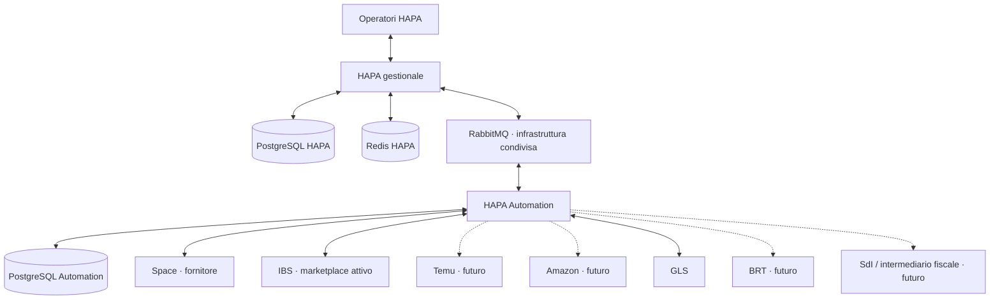
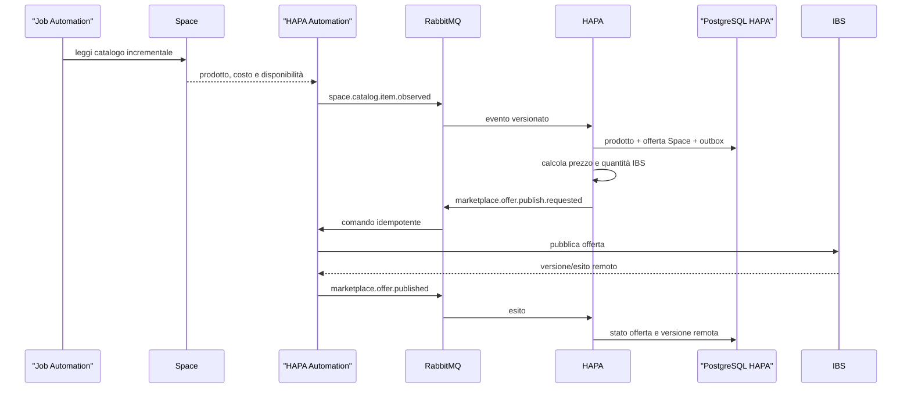
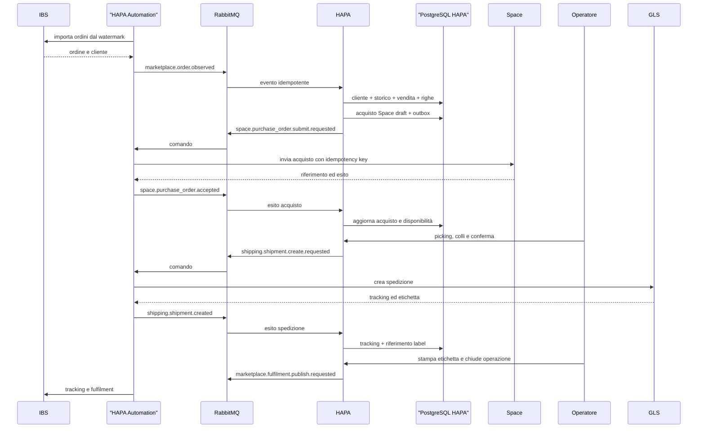
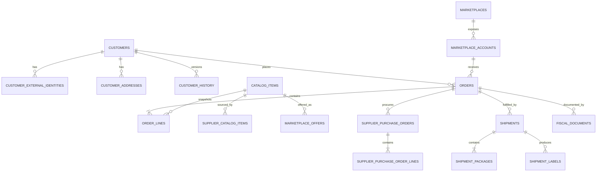
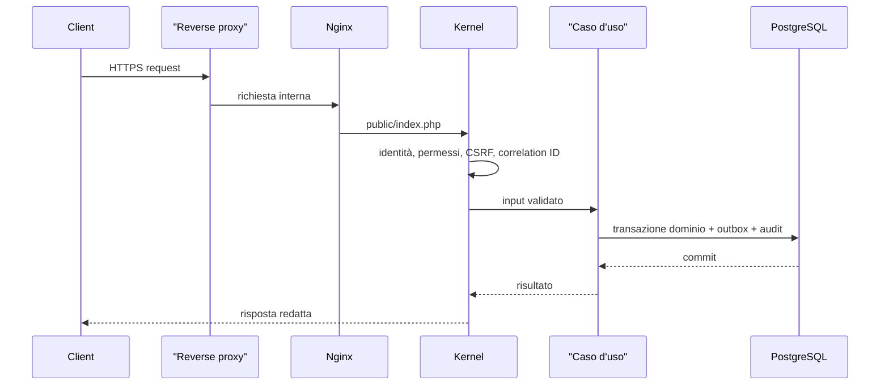
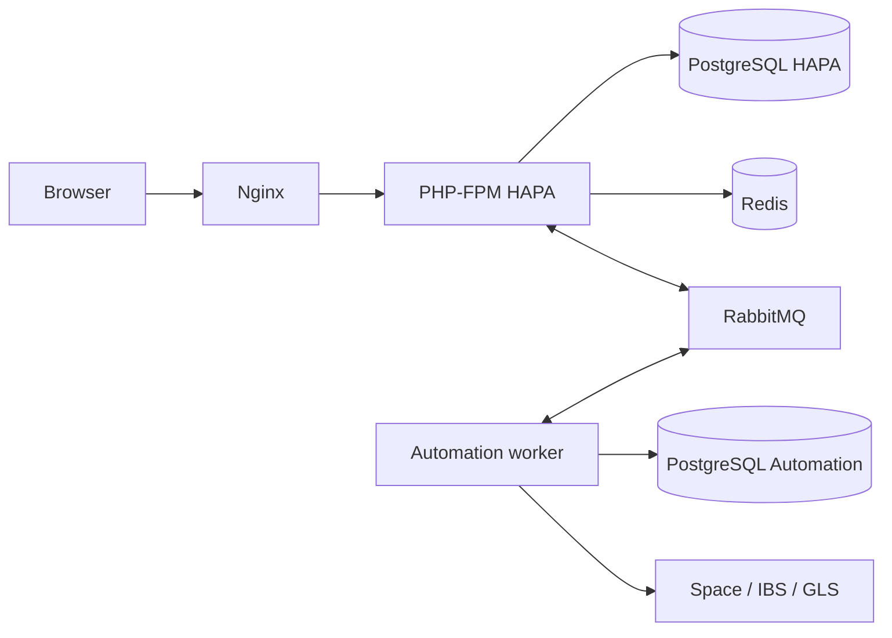
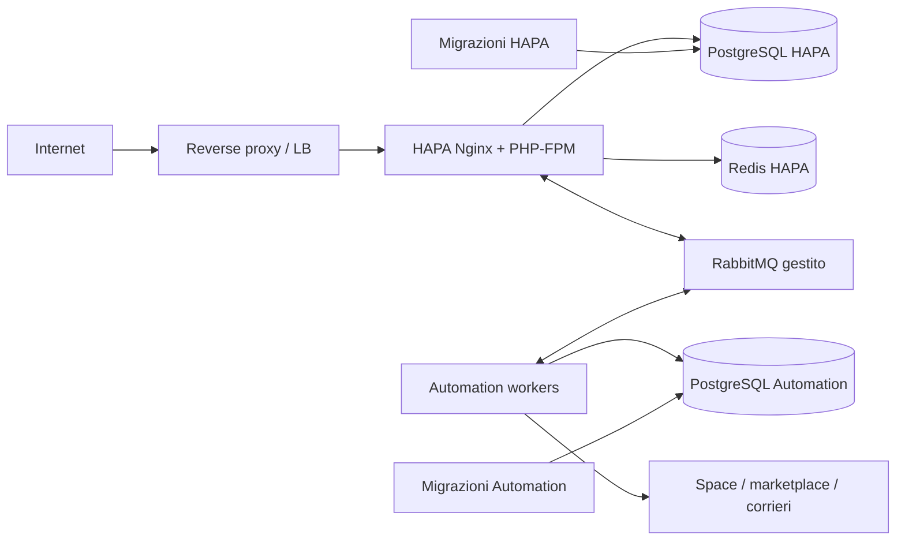

# Architettura del sistema HAPA

Ultimo riesame: 17 luglio 2026.

## 1. Scopo e contesto aziendale

HAPA è il gestionale della realtà commerciale separata fisicamente e amministrativamente da Space. HAPA acquista articoli da Space e li rivende sui marketplace. IBS è il canale attivo; Temu e Amazon sono pianificati. GLS è il primo corriere del flusso operativo; BRT è previsto successivamente.

La separazione da Space è un confine aziendale oltre che tecnico. Space è trattato come fornitore esterno: HAPA conserva il proprio catalogo commerciale, i propri acquisti, le proprie vendite, i clienti e la propria documentazione. Gli identificativi Space restano riferimenti esterni.

Il sistema è formato da due applicazioni:

- **HAPA**: gestionale e system of record del business;
- **HAPA Automation**: runtime tecnico delle integrazioni e delle attività asincrone.

## 2. Principi non negoziabili

1. Ogni dato di business ha un solo proprietario autorevole.
2. Prodotti, clienti, ordini di vendita, acquisti, spedizioni e documenti appartengono a HAPA.
3. Automation possiede soltanto esecuzione tecnica, cursori, retry, rate limit, idempotenza provider e proiezioni ricostruibili.
4. Nessun servizio legge o scrive il database dell’altro.
5. Space, marketplace e corrieri non determinano direttamente lo stato interno HAPA: producono osservazioni o esiti che HAPA valida e applica.
6. HAPA decide prezzi, ricarichi, quantità vendibili, acquisti, spedizioni e chiusura ordine.
7. Una modifica di dominio e il relativo messaggio sono atomici tramite transactional outbox.
8. Un messaggio ricevuto e la sua applicazione sono atomici tramite inbox.
9. Le chiamate con esito ambiguo vengono riconciliate prima di un nuovo tentativo.
10. I flussi vengono attivati per singolo account e capacità, iniziando da IBS.

## 3. Contesto del sistema

Il diagramma di contesto recupera e aggiorna lo schema storico rimosso durante la separazione dei repository.

RabbitMQ è condiviso come infrastruttura di trasporto, non come proprietario dei dati. In sviluppo può essere avviato dal Compose Automation; in produzione deve essere considerato una dipendenza infrastrutturale autonoma con ACL separate.

## 4. Bounded context HAPA

| Contesto | Responsabilità |
|---|---|
| Catalog | prodotto canonico HAPA, codici, descrizioni e stato commerciale |
| Supplier | offerta Space, costo di acquisto, disponibilità e ordini di acquisto |
| Pricing | ricarichi, costi di canale, arrotondamento, prezzo e quantità desiderati |
| Sales | ordini marketplace, righe economiche, pagamenti noti e ciclo commerciale |
| Customers | cliente canonico, identità esterne, indirizzi, versioni e storico |
| Fulfillment | disponibilità, picking, colli, spedizioni, label e tracking |
| Marketplace | canali, account venditore, offerte e stato applicativo delle pubblicazioni |
| Fiscal | fatture, note, corrispettivi, ricevute e conservazione futura |
| Identity & Audit | utenti, ruoli, autorizzazioni e audit |

I moduli `Space`, `Marketplace`, `Gls` e `Brt` presenti nel codice HAPA descrivono contratti applicativi e tipi normalizzati. I client e i protocolli provider appartengono ad Automation.

## 5. Decisione sui database

### 5.1 Prodotti

Il prodotto resta in HAPA perché è l’oggetto venduto dalla società HAPA e deve sopravvivere a cambi di fornitore o connettore. Il dato Space viene separato come **offerta fornitore**:

- `catalog_items`: identità commerciale HAPA;
- `supplier_catalog_items`: mapping Space, costo, disponibilità e versione osservata;
- `pricing_rules`: decisioni commerciali HAPA;
- `marketplace_offers`: prezzo e quantità desiderati per account-canale.

Automation può ricevere un comando di pubblicazione contenente già prezzo e quantità. Non deve ricevere le regole per ricalcolarle.

### 5.2 Ordini

L’ordine marketplace è un **ordine di vendita** HAPA. L’invio a Space crea un distinto **ordine di acquisto**. Non è corretto usare un solo stato per rappresentare entrambe le cose.

Esempio:

- vendita: `received`, `confirmed`, `in_fulfillment`, `shipped`, `closed`, `cancelled`;
- acquisto Space: `draft`, `requested`, `accepted`, `partially_available`, `ready`, `rejected`, `cancelled`;
- spedizione: `draft`, `requested`, `label_available`, `shipped`, `delivered`, `error`;
- fiscale futuro: stato separato dal ciclo logistico.

Il campo legacy `orders.status` viene mantenuto durante la migrazione, ma le nuove capacità non devono aggiungervi stati di acquisto, corriere o fatturazione.

### 5.3 Clienti e storico

HAPA conserva:

- profilo cliente corrente;
- identità esterne per account e canale;
- rubrica corrente;
- versioni append-only del profilo;
- snapshot immutabili di fatturazione e spedizione sull’ordine;
- audit delle fusioni, rettifiche, anonimizzazioni e accessi sensibili.

Automation tratta i dati personali soltanto per il tempo necessario alla chiamata provider e secondo retention esplicita.

### 5.4 Automation

Il database Automation conserva:

- inbox e outbox tecniche;
- job di polling e riconciliazione;
- checkpoint e watermark;
- operazioni provider e chiavi di idempotenza;
- tentativi, backoff, esiti redatti e riferimenti remoti;
- proiezioni minime ricostruibili.

Non conserva una seconda anagrafica commerciale.

Il modello completo è in [`DATA_MODEL.md`](DATA_MODEL.md).

## 6. Direzione dei messaggi

| Direzione | Tipo | Esempi |
|---|---|---|
| Automation → HAPA | osservazione provider | `space.catalog.item.observed`, `marketplace.order.observed` |
| HAPA → Automation | comando di business | `marketplace.offer.publish.requested`, `space.purchase_order.submit.requested`, `shipping.shipment.create.requested` |
| Automation → HAPA | esito provider | `marketplace.offer.published`, `space.purchase_order.accepted`, `shipping.shipment.created` |
| HAPA → Automation | evento necessario a una proiezione tecnica | `order.changed`, soltanto durante la transizione e per casi espliciti |

I job di polling (`sync Space`, `import IBS`, riconciliazione) nascono in Automation. Le azioni che modificano un rapporto commerciale (`ordina a Space`, `pubblica prezzo`, `crea spedizione`, `chiudi fulfilment`) nascono da un comando HAPA e non da un timer.

## 7. Catalogo e pubblicazione offerta

Il cursore Space avanza in Automation solo secondo una policy che impedisca la perdita dell’osservazione. Un dato fuori ordine non regredisce la versione applicata in HAPA.

## 8. Ordine, acquisto e spedizione

Il dettaglio degli errori e delle compensazioni è in [`BUSINESS_FLOWS.md`](BUSINESS_FLOWS.md).

## 9. Modello dati principale

Le entità fiscali sono pianificate e non vengono create finché commercialista, canale telematico, regole IVA e retention non sono formalmente approvati.

## 10. Ciclo HTTP HAPA

## 11. Topologia runtime

### Sviluppo

### Produzione

I PostgreSQL non condividono rete o credenziali. Il broker usa account separati per producer e consumer, routing key allowlisted, TLS fuori dal nodo locale e dead-letter queue osservabili.

## 12. Strategia di migrazione

La riorganizzazione è incrementale:

1. introdurre tabelle esplicite per account marketplace, offerta Space, acquisti, storico cliente, colli ed etichette;
2. preservare i dati nelle tabelle legacy;
3. scrivere le nuove vertical slice soltanto sul modello corretto;
4. backfill e riconciliare i dati esistenti;
5. bloccare le vecchie scritture;
6. rimuovere colonne o proiezioni legacy in una migrazione successiva e verificata.

La tabella HAPA `external_deliveries` diventa legacy: le nuove operazioni provider vengono registrate in `provider_operations` nel database Automation. Nessuna migrazione tenta un trasferimento cross-database implicito.

## 13. Fiscalità futura

Fatture elettroniche e corrispettivi appartengono a HAPA perché sono documenti e adempimenti della società HAPA. Automation potrà trasmettere file e ricevere notifiche, ma non numerare, modificare o ricostruire autonomamente i documenti.

Il modulo è descritto in [`FISCAL.md`](FISCAL.md). L’implementazione è bloccata fino alla validazione professionale e delle specifiche tecniche vigenti.

## 14. Stato implementativo

Implementato o disponibile:

- dominio ordine di vendita e persistenza transazionale;
- clienti e identità esterne iniziali;
- catalogo, ricarichi e offerte iniziali;
- outbox HAPA e runtime Automation separato;
- RabbitMQ con envelope versionato;
- test end-to-end iniziale HAPA → Automation.

Da riallineare:

- ordine di acquisto Space separato dalla vendita;
- account marketplace espliciti;
- snapshot economici completi delle righe;
- storico append-only cliente;
- comandi ed eventi con direzione corretta;
- rimozione delle decisioni commerciali dalle proiezioni Automation;
- vertical slice IBS, Space e GLS reali;
- autenticazione, autorizzazione e audit operativi;
- modulo fiscale futuro.
