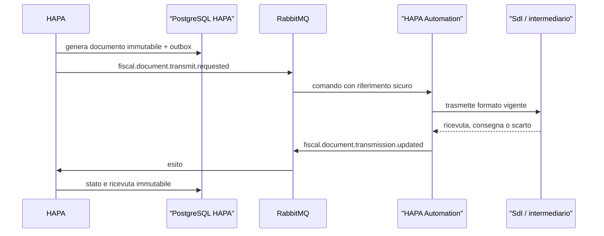

# Fatturazione elettronica e corrispettivi

Ultimo riesame: 17 luglio 2026.

## Confine

Il futuro modulo fiscale appartiene a HAPA perché documenta operazioni della società HAPA. Automation può trasmettere file e ricevere notifiche da SdI, Agenzia delle Entrate o da un intermediario, ma non decide numerazione, imponibile, IVA, data di emissione o annullamento.

## Modello previsto

HAPA dovrà conservare in modo immutabile e versionato:

- soggetto emittente e cliente destinatario;
- snapshot fiscale dell’ordine;
- imponibili, imposte, arrotondamenti e totali;
- tipo documento, numero, sezionale e data;
- XML o documento canonico prodotto;
- hash e versione delle regole usate;
- stato di trasmissione e ricevute;
- scarti, correzioni e note di variazione;
- riferimenti alla conservazione elettronica;
- corrispettivi e aggregazioni richieste dal canale adottato.

## Flusso distribuito futuro

## Gate obbligatori

Prima di creare tabelle o codice operativo servono:

1. validazione del commercialista e del consulente fiscale;
2. scelta documentata tra canale diretto e intermediario;
3. specifiche tecniche vigenti di fattura elettronica e corrispettivi;
4. regole IVA, natura, esigibilità, bollo e territorialità applicabili;
5. numerazione, sezionali, date e casi di nota di credito;
6. retention, conservazione e accesso autorizzato;
7. sandbox o collaudo del canale;
8. gestione di scarto, duplicato, timeout e riconciliazione;
9. audit e segregazione dei ruoli;
10. test end-to-end con documenti non reali.

Le specifiche fiscali sono esterne e soggette ad aggiornamento. Il repository deve versionare il riferimento normativo e tecnico usato da ogni release, senza codificare regole non approvate in documentazione generica.
