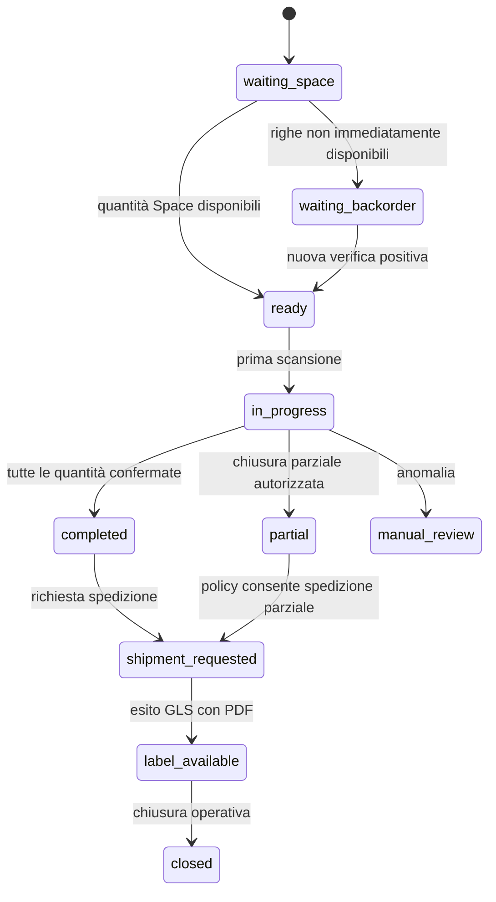
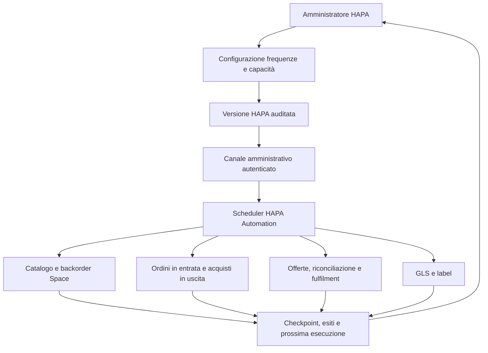

# Note di sistema HAPA

Ultimo riesame: 19 luglio 2026.

## 1. Scopo del documento

Queste note integrano la documentazione esistente con direttive funzionali, operative e di interfaccia. Diagrammi, tabelle, flussi e decisioni già presenti negli altri documenti restano validi e non devono essere rimossi: le nuove capacità devono essere aggiunte mantenendo la tracciabilità delle decisioni precedenti.

HAPA è l'identità dell'azienda. L'applicazione deve essere presentata come **Portale operativo HAPA** o **portale aziendale**, evitando di trattare HAPA come il nome commerciale del software.

## 2. Catalogo commerciale

La sezione catalogo gestisce l'anagrafica prodotti HAPA, i dati osservati da Space, le decisioni commerciali e le intenzioni di pubblicazione verso i marketplace.

### 2.1 Responsabilità

| Area | Responsabilità |
|---|---|
| Space | fornisce SKU e identificativi esterni, costo osservato, disponibilità in stock, disponibilità in backorder e versione sorgente |
| HAPA | conserva il prodotto canonico, approvazione, blocchi, scorta di sicurezza, regole commerciali, prezzo finale, quantità vendibile e decisione di pubblicazione |
| HAPA Automation | acquisisce le osservazioni Space, esegue i comandi provider e restituisce esiti e riconciliazioni |
| SellRapido / marketplace | applica anagrafica, prezzo, quantità e fulfilment secondo il contratto del canale |

### 2.2 Pagina catalogo

La pagina deve mantenere una vista aggregata del catalogo e consentire:

- ricerca per SKU, EAN, artista, titolo, formato e nome prodotto;
- filtri per stato di revisione, stato commerciale, stock, backorder, età del dato, marketplace e stato di pubblicazione;
- apertura della scheda del singolo prodotto;
- modifica dei dati HAPA consentiti, approvazione, rifiuto, blocco e sblocco commerciale;
- gestione della scorta di sicurezza e ricalcolo delle offerte;
- consultazione delle offerte HAPA e degli esiti marketplace;
- evidenza separata di merce disponibile in stock e merce disponibile in backorder.

La tabella operativa deve poter mostrare almeno:

| Campo | Contenuto |
|---|---|
| SKU | SKU canonico e riferimenti esterni |
| Prodotto | artista, titolo, formato e descrizione |
| Costo Space | costo osservato e valuta |
| Stock Space | quantità immediatamente disponibile |
| Backorder Space | disponibilità o quantità ordinabile non immediata |
| Vendibile HAPA | quantità decisa da HAPA dopo riserva e policy |
| Versione | versione sorgente e identificativo osservazione |
| Revisione | `pending_review`, approvato, rifiutato o conflitto |
| Età dato | tempo dall'ultima osservazione valida |
| Offerte HAPA | numero e stato delle intenzioni per canale |
| Pubblicazione | applicata, pendente, bloccata, fallita o da riconciliare |
| Azioni | dettaglio, approva, rifiuta, blocca, modifica e ricalcola |

La scheda del prodotto opera sul singolo articolo. Le regole di pubblicazione e le politiche commerciali, invece, appartengono al catalogo o a un suo sottoinsieme determinato da criteri dichiarativi; non devono essere modellate come una sequenza di modifiche manuali SKU per SKU.

### 2.3 Indicatori di sintesi

La testata della pagina deve distinguere almeno:

| Indicatore | Significato |
|---|---|
| Prezzo Space | prodotti censiti con costo Space consultabile |
| Stock Space | prodotti con disponibilità immediata osservata |
| Backorder Space | prodotti ordinabili o attesi ma non immediatamente disponibili |
| Regole di ricarico | politiche commerciali disponibili nel motore prezzi |
| Pubblicazione | dati mai osservati, obsoleti, bloccati o in attesa di riconciliazione |

L'età massima predefinita per considerare obsoleto un dato può partire da 24 ore, ma deve essere configurabile per account e capacità.

## 3. Regole di ricarico

Le regole di ricarico restano versionate, auditate e applicate dal motore prezzi HAPA.

### 3.1 Campi minimi

- codice;
- nome;
- ambito;
- marketplace opzionale;
- selettore di catalogo opzionale;
- tipo di calcolo;
- valore, inclusi i basis point per le percentuali;
- valuta;
- prezzo minimo e massimo in centesimi;
- priorità;
- validità temporale;
- stato abilitato/disabilitato;
- versione e audit.

`1000` basis point corrispondono al `10%`. Gli importi monetari persistiti nei campi tecnici restano espressi in centesimi.

### 3.2 Precedenza commerciale

La precedenza attuale resta:

| Ordine | Ambito | Significato |
|---:|---|---|
| 1 | Marketplace + SKU o selettore equivalente | eccezione più specifica |
| 2 | SKU o selettore di prodotto trasversale | regola prodotto applicabile a più canali |
| 3 | Marketplace | policy del singolo canale |
| 4 | Globale | fallback generale |

L'anteprima deve spiegare quale regola ha vinto, quali regole sono state escluse, il costo Space utilizzato e ogni blocco che impedisce la pubblicazione. Commissioni, regime IVA e arrotondamenti del canale entrano nel calcolo soltanto dopo la validazione dei contratti ufficiali.

## 4. Filtri di pubblicazione marketplace

HAPA deve permettere politiche di inclusione ed esclusione applicate alla pubblicazione del catalogo. I filtri sono configurazioni di catalogo, versionate e auditate, non attributi manuali del singolo prodotto.

### 4.1 Campi filtrabili

I criteri devono supportare almeno:

- SKU;
- EAN;
- artista;
- titolo;
- formato;
- nome o descrizione prodotto;
- marketplace e account;
- stato commerciale;
- disponibilità in stock o backorder.

### 4.2 Operatori

Gli operatori minimi sono:

- uguale;
- diverso;
- contiene;
- non contiene;
- inizia con;
- non inizia con;
- termina con;
- non termina con;
- appartiene a un elenco;
- non appartiene a un elenco.

Esempio: con SKU `223A3432233` deve essere possibile includere oppure escludere tutti gli SKU che contengono `223A`. Lo stesso modello deve permettere inclusioni o esclusioni per artista, titolo e formato.

### 4.3 Composizione e conflitti

Ogni policy contiene:

- account e marketplace destinatario;
- azione `include` oppure `exclude`;
- uno o più criteri;
- composizione `tutti` oppure `almeno uno`;
- priorità;
- validità temporale;
- stato;
- motivazione operativa;
- versione e audit.

La valutazione deve essere deterministica. A parità di priorità, un'esclusione prevale su un'inclusione, salvo una eccezione più specifica esplicitamente configurata. L'anteprima deve mostrare il risultato per prodotto e il percorso decisionale completo.

### 4.4 Flusso

```mermaid
flowchart LR
    Space["Space: costo, stock e backorder"] --> Observation["Osservazione normalizzata"]
    Observation --> Catalog["Catalogo HAPA"]
    Catalog --> Review["Revisione e blocchi prodotto"]
    Review --> Pricing["Regole di ricarico"]
    Pricing --> PublicationPolicy["Filtri inclusione/esclusione catalogo"]
    PublicationPolicy --> Intent["Prezzo e quantità desiderati"]
    Intent --> Automation["HAPA Automation"]
    Automation --> Marketplace["SellRapido / marketplace"]
    Marketplace --> Reconciliation["Esito e riconciliazione"]
    Reconciliation --> Catalog
```

## 5. Login e identità del portale

La schermata di accesso deve essere neutra e istituzionale.

### 5.1 Testo previsto

- intestazione: **Portale operativo HAPA**;
- sottotitolo: **Accesso ai servizi aziendali**;
- titolo form: **Accedi**;
- istruzione: **Inserisci le credenziali del tuo account aziendale.**;
- campi: **Email aziendale** e **Password**;
- opzione: **Ricorda questo dispositivo**;
- azione principale: **Accedi**;
- collegamento: **Password dimenticata?**;
- assistenza: **Per problemi di accesso, contatta l'amministratore di sistema.**;
- nota: **Accesso riservato al personale autorizzato.**

### 5.2 Elementi da rimuovere

Devono essere rimossi dalla schermata di accesso:

- “Ogni ordine. Un solo controllo.”;
- descrizioni operative di ordini, picking, spedizioni e audit;
- claim promozionali sulle funzionalità;
- breadcrumb operativo;
- “Centro operativo”.

`Ambiente development` e correlation ID possono restare soltanto come informazioni tecniche discrete a fondo pagina e non devono apparire come contenuto principale.

## 6. Picking

Il picking è una capacità centrale e nasce dalla sezione ordini quando l'evasione Space rende disponibili una o più righe.

### 6.1 Generazione

- il picking viene generato automaticamente in base allo stato e alle quantità evase da Space;
- stock immediato e backorder devono restare distinguibili per ogni riga;
- le righe ancora in backorder vengono ricontrollate secondo una frequenza configurabile;
- eventi duplicati o regressivi non devono creare sessioni duplicate né ridurre quantità già confermate;
- l'operatore può vedere la causa di attesa o anomalia.

### 6.2 Scadenza operativa

Deve essere configurabile un orario limite giornaliero per completare i picking destinati al carico del corriere, inizialmente rappresentabile con le ore `15:00` ma modificabile dall'amministrazione.

La configurazione deve supportare almeno:

- timezone;
- orario limite per giorno della settimana;
- giorni non operativi e festività;
- margine minimo prima della chiusura corriere;
- comportamento dei picking incompleti alla scadenza;
- priorità ed evidenza dei picking prossimi alla scadenza.

### 6.3 Pagina di lavorazione

La pagina interna del picking deve mostrare:

| Campo | Contenuto |
|---|---|
| Ordine | riferimento HAPA e origine marketplace |
| Cliente | nominativo e destinazione redatta secondo i permessi |
| Scadenza | tempo residuo al limite operativo |
| Riga | posizione e quantità richiesta |
| EAN | codice da acquisire con lettore barcode |
| SKU | identificativo prodotto |
| Artista | artista normalizzato o snapshot ordine |
| Titolo | titolo normalizzato o snapshot ordine |
| Formato | formato commerciale |
| Disponibilità | stock, backorder, disponibile, mancante o anomalia |
| Quantità | richiesta, scansionata, residua e non disponibile |

L'operatore deve poter acquisire ripetutamente i codici a barre fino al completamento delle quantità, con feedback immediato per codice valido, duplicato, eccedente o non appartenente all'ordine.

Devono essere disponibili dati dimostrativi e fixture con picking:

- pronto da iniziare;
- parzialmente scansionato;
- completo;
- con riga in backorder;
- con EAN errato;
- prossimo alla scadenza.

### 6.4 Chiusura e spedizione

Al termine l'operatore può:

- chiudere il picking completo;
- chiudere il picking parziale indicando quantità mancanti e motivazione;
- lasciare il picking in attesa di backorder;
- inviare a revisione un'anomalia;
- avviare la richiesta di spedizione.

Dalla stessa pagina deve essere possibile lanciare la richiesta di spedizione, attendere l'esito asincrono, ottenere la lettera di vettura in PDF, visualizzarla e stamparla senza creare una seconda spedizione. La stampa o ristampa usa il documento già associato alla spedizione o una rigenerazione tecnica riconciliata.

## 7. Ordini

La sezione ordini consulta l'anagrafica e controlla origine, cliente, righe economiche, acquisto Space, picking, spedizione e fulfilment marketplace.

Dal dettaglio ordine, secondo permessi e stato, devono essere disponibili:

- richiesta o selezione dell'emissione fattura;
- modifica controllata dei dati modificabili dell'ordine, con versionamento e audit;
- annullamento con motivazione e transizioni consentite;
- apertura del successivo processo di reso, da implementare come capacità separata;
- generazione o apertura del picking;
- consultazione dello stato Space, incluse righe in stock e backorder;
- consultazione di spedizione, tracking, label e stato marketplace.

L'annullamento non elimina l'ordine e non implica automaticamente un rimborso, un reso o l'annullamento dell'acquisto Space: ogni processo mantiene stato, autorizzazioni e audit separati.

## 8. Guida in linea

La barra di navigazione deve includere un pulsante **Guida** sempre raggiungibile dagli utenti autenticati.

La guida deve:

- spiegare le funzionalità disponibili passo per passo;
- adattare i contenuti ai permessi dell'utente;
- fornire percorsi per catalogo, regole prezzi, pubblicazione, ordini, picking, spedizioni, integrazioni, utenti e audit;
- collegare ogni pagina alla sezione contestuale pertinente;
- distinguere procedure operative, spiegazioni di stato e risoluzione delle anomalie;
- essere versionata insieme alle funzionalità applicative.

## 9. Utenti, ruoli e permessi

La sezione amministrativa deve essere operativa e deve permettere la creazione diretta degli utenti; il modello non è basato su un invito via email.

L'amministratore deve poter:

- creare un utente con nome, email aziendale, stato e credenziale iniziale gestita in modo sicuro;
- obbligare il cambio password al primo accesso quando previsto;
- abilitare, sospendere, riattivare e disabilitare un account;
- assegnare uno o più ruoli;
- creare e modificare ruoli;
- associare permessi granulari ai ruoli;
- consultare accessi, modifiche e audit;
- revocare sessioni attive;
- applicare optimistic locking alle modifiche amministrative.

La UI non deve presentare l'azione principale come “Invita utente”.

## 10. Integrazioni e scheduling

Deve esistere una sezione unificata che mostri lo stato di tutte le integrazioni e permetta di gestire le frequenze operative consentite.

### 10.1 Stato integrazioni

Per ogni account e capacità devono essere visibili:

- provider, account, ambiente e capacità;
- stato configurazione HAPA;
- versione applicata da Automation;
- stato credenziali senza esporre segreti;
- ultimo test connessione;
- ultima esecuzione riuscita;
- ultimo tentativo ed errore redatto;
- checkpoint o watermark;
- ritardo corrente;
- prossimo avvio pianificato;
- code pendenti, retry e dead state aggregati;
- stato abilitato, sospeso o in pilot.

### 10.2 Frequenze gestibili

Devono essere configurabili almeno:

| Processo | Frequenza o regola |
|---|---|
| catalogo Space | aggiornamento incrementale di prezzo, stock e backorder |
| verifica backorder Space | ricontrollo delle righe non immediatamente disponibili |
| ordini marketplace in entrata | import ordini e modifiche da SellRapido |
| acquisti in uscita verso Space | relay dei comandi e riconciliazione degli esiti |
| offerte marketplace in uscita | pubblicazione di anagrafica, prezzo e quantità |
| riconciliazione marketplace | rilettura periodica di offerte e ordini |
| fulfilment marketplace | pubblicazione tracking e stato |
| spedizioni | riconciliazione degli stati GLS e disponibilità label |

La UI gestisce la configurazione non segreta e la versione desiderata. Automation applica lo scheduling tecnico, i lock, i retry e i rate limit. Frequenze incompatibili con i limiti contrattuali devono essere rifiutate o normalizzate con una spiegazione visibile.

## 11. Stock e backorder Space

Stock e backorder sono concetti distinti e devono incidere sul ciclo ordine.

- una riga con quantità immediatamente disponibile può avanzare verso evasione e picking;
- una riga in backorder resta associata all'acquisto e viene verificata periodicamente;
- la frequenza di verifica è configurabile per account Space;
- una nuova osservazione può rendere pronta una riga, ma non deve far regredire quantità già confermate;
- disponibilità parziale e totale devono essere rappresentate separatamente;
- la policy HAPA determina se attendere, spedire parzialmente, annullare una riga o richiedere una decisione manuale;
- il marketplace non viene aggiornato con uno stato finale finché vendita, acquisto, picking, spedizione e fulfilment non sono coerenti.

## 12. Requisiti trasversali

Tutte le nuove capacità devono rispettare:

- un solo writer autorevole per dato e capacità;
- optimistic locking per le modifiche da UI;
- audit con attore, versione precedente, nuova versione e motivazione;
- autorizzazione deny-by-default;
- idempotenza di comandi, eventi e generazioni automatiche;
- outbox e inbox transazionali;
- consistenza eventuale esplicitata nella UI;
- stati separati per vendita, acquisto, picking, spedizione, fulfilment e fiscale;
- anteprime deterministiche prima delle operazioni massive;
- nessuna credenziale o documento binario su RabbitMQ o nei log;
- mantenimento dei diagrammi e delle tabelle documentali esistenti durante ogni aggiornamento.